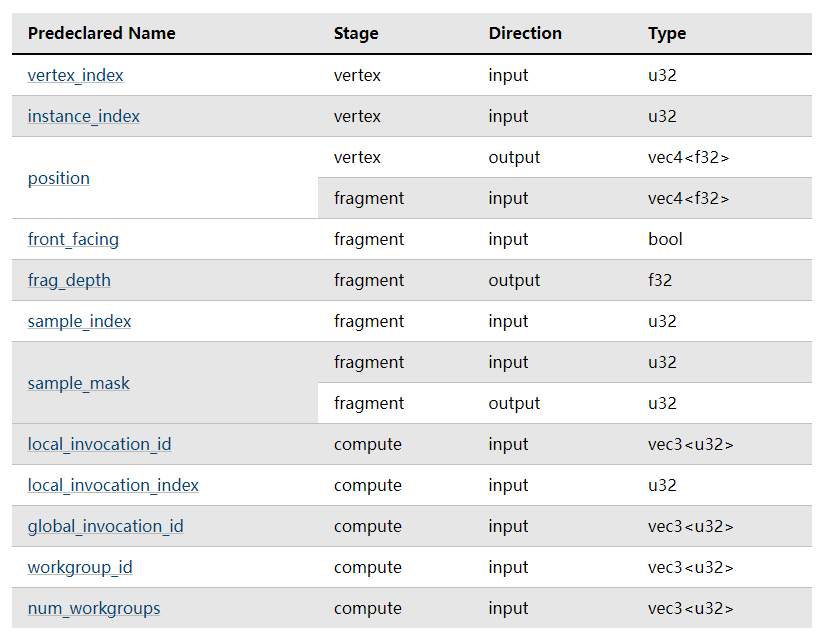

## 着色器

着色器是用于在计算机图形中处理渲染过程中各个特定阶段的小程序或代码片段。它们在现代图形处理单元（GPU）上运行，专门用于执行与图形渲染相关的计算任务。着色器是3D图形渲染中的关键组成部分，它们负责从基本的几何形状生成复杂的视觉效果。

着色器主要有以下几种类型：

1. **顶点着色器（Vertex Shaders）**：这些着色器处理每个顶点的数据，如顶点的位置、颜色、纹理坐标等。它们通常用于执行如变换坐标、投影顶点到屏幕空间等操作。

2. **片元着色器（Fragment Shaders）**：也称为像素着色器，这些着色器处理渲染过程中的每个像素。它们用于计算最终像素的颜色和其他属性，如光照、纹理映射、阴影等效果。

3. **几何着色器（Geometry Shaders）**：这些着色器在顶点和片元着色器之间运行，处理整个图元（如点、线、三角形）。它们可以生成新的顶点和形状，用于实现特殊的图形效果。

4. **计算着色器（Compute Shaders）**：这些着色器不直接用于渲染图形，而是用于进行通用的计算任务。计算着色器可以用于各种非图形的并行计算任务，如物理模拟、数据处理等。

